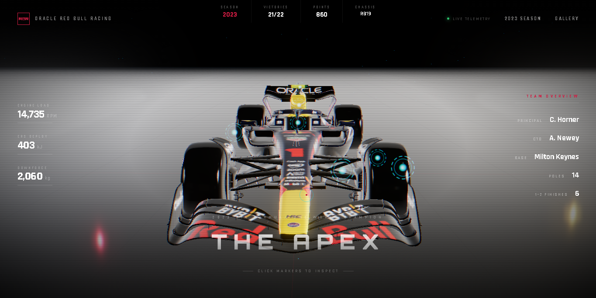
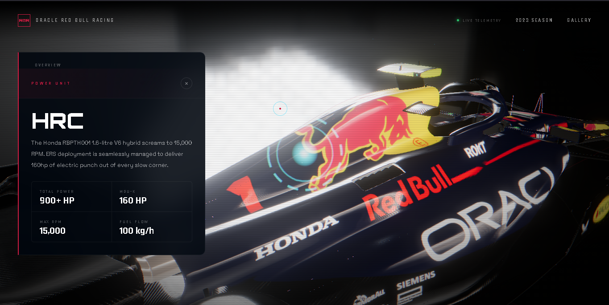
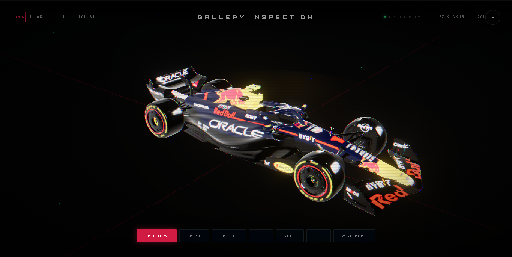

<div align="center">

# 🏎️ RB19 — Formula 1 Telemetry Dashboard

### An Immersive Interactive 3D Experience of the Most Dominant F1 Car Ever Built

[](https://rb19-5qi.pages.dev/)
[](https://threejs.org/)
[](https://www.khronos.org/webgl/)
[](LICENSE)

<p align="center">
  <a href="https://rb19-5qi.pages.dev/">🌐 Live Demo</a>
</p>

</div>

---

##  About

**RB19 Formula 1 Telemetry Dashboard** is an immersive Three.js-powered web experience that recreates the legendary Oracle Red Bull Racing RB19 in an interactive 3D environment.

The project combines modern WebGL rendering, telemetry visualization, engineering insights, cinematic effects, and complete 2023 season statistics into a premium motorsport-inspired showcase.

###  Highlights

- Interactive 3D RB19 model
- Real-time telemetry simulation
- Engineering hotspot inspection system
- Dynamic camera transitions
- Showroom mode
- Complete 2023 Formula 1 season archive
- HDR lighting and post-processing effects
- Custom cursor system
- Responsive futuristic UI

---

##  Live Demo

### Experience the Project

👉 **https://rb19-5qi.pages.dev/**

---

##  Features

### 🏁 Interactive 3D Experience

- Fully explorable RB19 3D model
- Smooth camera controls
- Dynamic showroom mode
- Multiple viewing perspectives
- Optimized WebGL rendering

###  Telemetry Dashboard

Monitor simulated race telemetry including:

- Engine RPM
- ERS Deployment
- Downforce Metrics
- Performance Monitoring
- Live Data Visualization

###  Engineering Inspection System

Explore key RB19 systems through interactive hotspots:

- Aerodynamics
- Ground Effect Floor
- Honda Power Unit
- Suspension Geometry
- DRS System
- Braking Systems
- Driver Analytics

###  Cinematic Visual Effects

- HDR Environment Lighting
- Unreal Bloom
- RGB Shift Effects
- Atmospheric Particles
- Dynamic Shadows
- Glassmorphism UI
- Scanline Overlay Effects

###  Responsive Design

Optimized for:

- Desktop
- Laptop
- Tablet
- Mobile Devices

---

##  Tech Stack

### Frontend

- HTML5
- CSS3
- JavaScript (ES Modules)

### 3D Graphics

- Three.js
- GLTF Loader
- DRACO Loader
- OrbitControls
- WebGL

### Animation

- GSAP

### Styling

- Tailwind CSS

### Deployment

- Cloudflare Pages

---

##  Screenshots

### Homepage

```markdown

```

### Telemetry Dashboard

```markdown

```

### Showroom Mode

```markdown

```

---

## 🚀 Installation

Clone the repository:

```bash
git clone https://github.com/MR-05-001/RB19.git
```

Navigate to the project:

```bash
cd RB19
```

Run a local server:

```bash
python -m http.server 8000
```

Open:

```text
http://localhost:8000
```
---
##  Inspiration

Inspired by:

- Oracle Red Bull Racing
- Formula 1 Telemetry Systems
- Motorsport Engineering Dashboards
- Aviation HUD Interfaces
- Cyberpunk UI Design
- Interactive Data Visualization

---

##  Credits & Attribution

### 3D Model

**Oracle Red Bull F1 Car RB19 2023**

Created by **Redgrund**

🔗 Sketchfab:
https://skfb.ly/oR7sq

🔗 Original Model:
https://sketchfab.com/3d-models/oracle-red-bull-f1-car-rb19-2023-e4afe46f3aab4b23a418da06fc163821

### License

Creative Commons Attribution 4.0 International (CC BY 4.0)

https://creativecommons.org/licenses/by/4.0/

### Modifications

The original model has been integrated into a custom Three.js application featuring:

- Interactive telemetry systems
- Dynamic camera controls
- Engineering hotspot inspection
- Post-processing effects
- Real-time animations
- UI/UX implementation
- Performance optimization

Special thanks to **Redgrund** for making the RB19 model publicly available.

---

##  Disclaimer

This is a fan-made educational and portfolio project.

Formula 1, FIA, Oracle Red Bull Racing, Honda Racing, RB19, and all related trademarks belong to their respective owners.

This project is not affiliated with or endorsed by Formula One Management, FIA, Oracle Red Bull Racing, or Honda Racing.

---

##  License

This project is licensed under the MIT License.

The RB19 3D model is licensed separately under **CC BY 4.0** by Redgrund.

---

##  Support

If you enjoyed this project:

- ⭐ Star the repository
- 🍴 Fork the project
- 📢 Share it with fellow motorsport fans
- 🛠️ Contribute improvements

---

##  Author

Built with passion for:

- 🏎️ Formula 1
- 🎨 Engineering & Design
- 🌐 Interactive Web Experiences
- 🎮 Three.js & WebGL
- 📊 Data Visualization

---

<div align="center">

# THE ETERNAL APEX

### RB19 — The Most Dominant Formula 1 Car Ever Built

### 🌐 https://rb19-5qi.pages.dev/

</div>
